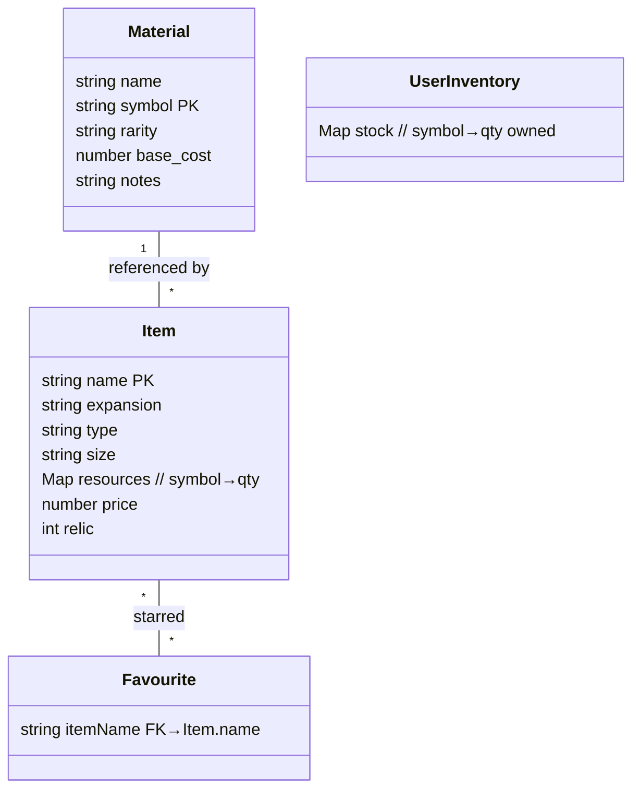

# Maladum Crafting Companion – Application Outline & Functional Spec (v1.2 – 2025‑12‑21)

## 1 Application Outline

The **Maladum Crafting Companion** is a lightweight, offline-capable progressive web application (PWA) designed to help players of the *Maladum* board game manage their crafting resources and discover craftable items.

*   **Architecture**: Pure client-side static application. No backend server or database.
*   **Entry Point**: `index.html` loads `js/app.js` as the main module.
*   **Data Flow**:
    *   Static data (`items.json`, `materials.json`, `tokens.json`) is fetched at runtime.
    *   User data (inventory counts, favourites, settings) is persisted to `localStorage` via `js/storage.js`.
*   **UI Rendering**: `js/ui/components.js` handles dynamic HTML generation based on current state.
*   **Offline Mode**: A Service Worker (`service-worker.js`) caches all assets and JSON data for offline use.

## 2 Technology Stack

| Layer        | Implementation                                          |
| ------------ | ------------------------------------------------------- |
| **Frontend** | **HTML5** + **Vanilla JavaScript** (ES6 Modules)        |
| **Styling**  | Tailwind CSS (via CDN) + Custom CSS (`styles.css`)      |
| **Build**    | **None** (Static file serving)                          |
| **Persistence** | `localStorage` (via `js/localStorageUtil.js`)        |
| **PWA**      | Custom Service Worker + Manifest                        |
| **Hosting**  | GitHub Pages                                            |

## 3 Purpose

A **mobile‑first**, completely **static** web tool (deployed via **GitHub Pages**) that lets Maladum players enter their available **materials** and instantly see every **item** they can craft, plus any deficits for starred favourites. The app must run entirely in‑browser, with no servers, accounts, or file uploads.

## 4 Target Users & Personas

| Persona             | Needs                                                             |
| ------------------- | ----------------------------------------------------------------- |
| **Solo skirmisher** | Track a single hero’s growing stash on a phone during game nights |
| **Campaign host**   | Keep party‑wide stock on a tablet and share the screen            |
| **Collector**       | Explore “what‑if” builds, bookmark dream gear and calculate prices |

## 5 Core Feature List

* **Inventory manager** – add/remove material counts
* **Craftable list** – live filter of all items you can currently build
* **Favourites / wish‑list** – star items and highlight deficits
* **Missing‑material breakdown** – consolidated shopping list with rarity & estimated price
* **Advanced filters** – by expansion, item type, size, relic requirement, rarity
* **Item detail panel** – art, description, full recipe, alternative recipes if variants exist
* **Relic & token tracking** – show token needs distinctly from normal materials
* **Offline‑first & PWA** – usable without signal at the club table

> **Removed**: any upload, import, export, cloud‑sync, or QR features

## 6 Detailed Feature Descriptions

### 6.1 Inventory Management

* Tap + / – buttons beside each material symbol (larger hit‑areas for thumbs)
* Materials grouped by rarity with colour badges

### 6.2 Crafting Suggestions

* Re‑computes instantly on every inventory change
* Sort presets: *Alphabetical*, *Fewest materials left*, *Highest relic value*, *Price ascending*

### 6.3 Favourites & Wish‑List

* Any item card can be ⭐‑toggled
* Wish view displays **☒ missing** chips per material
* Option to **hide fulfilled favourites** once crafted

### 6.4 Missing‑Material Summary

| Column | Notes                                      |
| ------ | ------------------------------------------ |
| Symbol | links to Material page                     |
| Name   | rarity colour dot                          |
| Needed | aggregated shortfall across favourites     |
| In Bag | current inventory count                    |
| Price  | `needed × base_cost` from `materials.json` |

### 6.5 Item Detail & Prices

* Pulls recipe from `items.json` and material metadata from `materials.json`
* Shows **price** for reference; optional *dynamic pricing* if house‑rules allow variable pricing

### 6.6 Filters & Sorting

* Type (Weapon/Armour/etc.)
* Expansion (Of Ale and Adventure, Oblivion’s Maw…)
* Size (XS – XL)
* Relic only / exclude relics
* Text search (fuzzy)

### 6.7 Expansion Toggle

Checkboxes per expansion hide unavailable gear, keeping UI small for new players.

### 6.8 Relic & Token Tracking

Separate counters for **relics** and **tokens** used by rare materials/items.

### 6.9 Offline Support

* Service worker precaches HTML/CSS/JS and JSON data
* Inventory, favourites, and settings saved to `localStorage`

### 6.10 Settings / Preferences

* Toggle dark‑mode
* Choose currency symbol / region price formatting
* Confirm before clearing inventory

## 7 Data Model



## 8 Craftability Algorithm (Vanilla JS)

```js
function getCraftableItems(inventory, items) {
  return items.filter(item =>
    Object.entries(item.resources).every(([sym, qty]) =>
      (inventory[sym] ?? 0) >= qty));
}
```

*Complexity*: *O(I × R)* where *I* = #items, *R* ≤ 5.

## 9 UI / UX Flow (mobile‑first wireframe outline)

```
[Home]
  ├─[Materials Grid]  (scrollable, thumb‑friendly)
  │    W 2   S 1  T 0 ...
  └─[Craftable List]
        ▸ Arrow – Viscous/Sharp
        ▸ Shillelagh (disabled – missing M)

[Item Detail Sheet]
  Image | Stats | ⭐
  Needed: W×1 S×1
  Craft (‑‑)

[Favourites]
  ▾ Missing materials table (§6.4)

[Settings]
  – Dark‑mode toggle
  – Clear inventory
```

## 10 Future Enhancements

* **Group inventories** for co‑op campaigns
* **Material market** with price history and trading suggestions
* **Push reminders** (requires backend; stretch goal)
* **Accessibility** improvements (screen‑reader labels, larger hit‑areas)
* **Multilingual UI** driven by i18n JSON bundles

## 11 Appendix

* **Materials** in base game: 16 (common → rare)
* **Items** loaded: 60+ across 3 expansions (auto‑parsed from JSON)

― **End of Spec**
